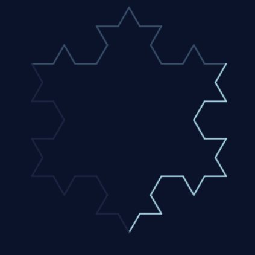
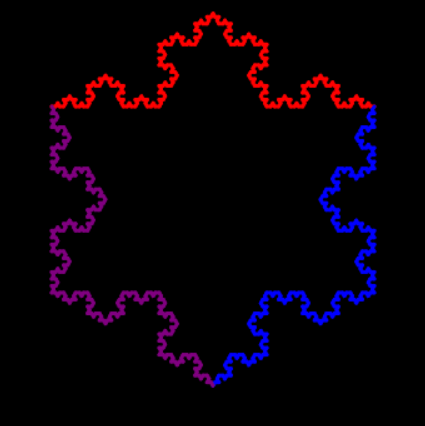

# Koch Snowflake Fractal Generator

## Project Overview

This Python project generates a **Koch Snowflake fractal** using **recursive functions** and **turtle graphics**. Users can customize the fractal's depth, colors, line thickness, and even create a fully custom color palette (limited to 3 colors).

The program demonstrates:

* Recursion and base cases
* User input for dynamic graphics
* Dictionaries for organizing fractal settings
* Return values from recursive functions
* Visual output with turtle graphics

---

## How to Run the Program

1. Open [Trinket](https://trinket.io/python) in your web browser.
2. Copy and paste the `main.py` code into a new Python Trinket.
3. Click **Run**.
4. Follow the on-screen prompts:

   * Enter recursion depth (0–5 recommended; higher values increase complexity).
   * Choose a color scheme (or create a custom palette).
   * Enter line thickness (1–10 recommended).
   * Choose whether to see the drawing live.
5. The Koch Snowflake will be drawn in the output window.

---

## Recursive Approach

The core recursion is implemented in the `koch_curve` function:

```
def koch_curve(t, length, level):
    if level == 0:
        t.forward(length)
        return 1
    length /= 3
    calls = 0
    calls += koch_curve(t, length, level - 1)
    t.left(60)
    calls += koch_curve(t, length, level - 1)
    t.right(120)
    calls += koch_curve(t, length, level - 1)
    t.left(60)
    calls += koch_curve(t, length, level - 1)
    return calls
```

* **Base case:** When `level == 0`, a straight line is drawn.
* **Recursive step:** Each line segment is divided into four smaller segments to create the Koch pattern.
* **Return value:** The function returns the total number of recursive calls.

The `draw_snowflake` function calls `koch_curve` three times to complete the triangular snowflake.

---

## Fractal Settings and Data Structures

The program uses **dictionaries** to store fractal settings:

```
fractal_settings = {
    "snowflake": {
        "colors": fg_colors,
        "bg": bg_color,
        "angle": 60,
        "length": 300
    }
}
```

* Users can choose **predefined color schemes** or create a **custom palette**.
* Background color and line thickness are customizable.

---

## User Input and Customization

* **Recursion depth:** Controls fractal detail.
* **Color scheme:** Choose from six options or create a custom palette.
* **Line thickness:** Adjust width of fractal lines.
* **Show drawing live:** Animate drawing or render instantly.
* **Custom palette:** Users can enter **up to 3 colors** for the snowflake. Colors are applied in order to each side.

---

## Sample Test Cases

| Test Case | Inputs                                              | Expected Output                            | Actual Output    |
| --------- | --------------------------------------------------- | ------------------------------------------ | ---------------- |
| 1         | Depth 2, Winter Night, Line 2                       | Simple 3-sided snowflake                   | Matches expected |
| 2         | Depth 4, Custom Palette (red, blue, purple), Line 3 | Detailed snowflake with alternating colors | Matches expected |

---

## Reasonable Recursion Depth

* **Too low (0–1):** Snowflake looks very simple.
* **Recommended (2–4):** Clear fractal detail, manageable rendering.
* **Too high (5+):** Can slow down drawing, high recursion count.

---

## Challenges Overcome

* Handling custom color palettes with a limit of 3 colors.
* Smooth rendering with optional live drawing using `screen.tracer(0)`.
* Random color selection for variety.

---

## Screenshots

1.   
*Simple Koch Snowflake with depth 2 using the Winter Night color scheme.*

2.   
*Detailed Koch Snowflake at depth 4 using a custom palette of red, blue, and purple.*


---

## Performance Considerations

* Recursion depth and line thickness affect rendering time.
* `screen.tracer(0)` improves performance for high recursion levels.
* Random color selection adds visual variety without affecting recursion.

---

## Peer Review Notes

* **Feedback:** Custom palette input was unclear.
* **Action Taken:** Added prompts and loop for multiple color input with a limit of 3 colors.


